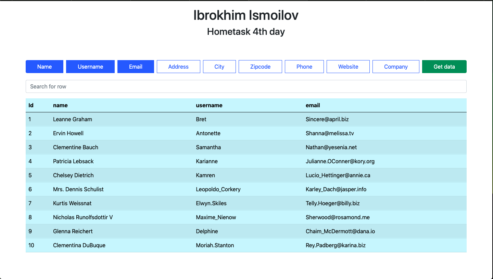

<h1 align="center">Welcome to filter fetch data practic lesson by Ibrokhim 👋</h1>

  

> Bu loyihada FETCH Get data ammalini filter orqalik amalga oshiriladi.

### 🏠 [Homepage](https://ibrokhim017.github.io/ES6-GetData-ArrayMethods/)

## Author

👤 **Ibrokhim Ismoilov**

- Website: https://Ibrokhim.uz
- Github: [@ibrokhim017](https://github.com/ibrokhim017)

## Show your support

Give a ⭐️ if this project helped you!

## Images

